<p id="home" align="center"><a href="https://rocket.chat/"></a></p>

[Sekilas Tentang](#sekilas-tentang) | [Instalasi](#instalasi) | [Konfigurasi](#konfigurasi) | [Otomatisasi](#otomatisasi) | [Cara Pemakaian](#cara-pemakaian) | [Pembahasan](#pembahasan) | [Referensi](#referensi)
:---:|:---:|:---:|:---:|:---:|:---:|:---:

# Sekilas Tentang
[`^ kembali ke atas ^`](#home)

<div >Rocket.Chat adalah solusi obrolan chat berbasis open source. Aplikasi ini dapat berjalan dengan desktop os, android, ios  atau dengan free trial cloud demo di web.

Rocket.chat merupakan sebuah perusahaan yang menciptakan aplikasi berbasis web dengan nama persis seperti nama perusahaannya yaitu Rocket.chat, yang berdasarkan nilai  open source dan kecintaan akan efisiensi. Perusahaan tersebut didukung oleh beberapa komunitas kontributor dari berbagai belahan dunia yang luar biasa, dengan anggota tim yang berbakat, yang bekerja tanpa lelah untuk menjaga agar kode tetap menjadi standar yang tinggi dan membuat hidup kontributor menjadi lebih mudah, yang dipimpin oleh  Gabriel Engel sebagai CEO nya.

Rocket.chat telah dinobatkan sebagai top project di Rookies Open Source Black Duck of the Year pada tahun 2016. Perusahaan tersebut berbasis di Brazil, namun sebagian besar tim bekerja dari jarak jauh. Pesaing utama dari Rocket.Chat adalah aplikasi seperti Slack dan HipChat.


# Instalasi
[`^ kembali ke atas ^`](#home)

Panduan ini dibangun dengan asumsi berikut:
- Sistem operasi: Ubuntu Server 16.04
- Layanan ssh berjalan.
- Layanan Rocket.Chat akan dijalankan pada `localhost`

## Prasyarat 
Ref: [[1]](#1)

|Spesifikasi   | VPS (minimal)         | VPS (recommended)    |
|---            |---                    |---|
|_Processor_   |Single core (2 GHz)   |Dual Core (2GHz)   |
|_Memory_      |1 GB RAM              |2 GB RAM|
|Penyimpanan     |30 GB SSD             |40 GB SSD|
|Kapasitas    |<ul><li>Ideal untuk penggunaan hingga 200 pengguna dengan 50 akses secara bersamaan.</li><li>Aktivitas _upload_, _sharing_, dan _bot_ pada level minimum.</li></ul>|<ul><li>Dapat mengakomodir penggunaan hingga 500 pengguna dengan 100 akses secara bersamaan.</li><li>Aktivitas _upload_, _sharing_, dan _bot_ pada level wajar.</li></ul>|

## Instalasi Cepat dengan Snaps (Disarankan)
```bash
  sudo snap install rocketchat-server
```

Setelah instalasi selesai, aplikasi langsung aktif pada port 3000 http dan dapat di akses melalui _url_ [http://localhost:3000](http://localhost:3000)

## Instalasi Secara Manual

Dependensi:
- Node.js (versi 4.5.0 atau lebih)
- MongoDB
- curl
- graphicsmagick

```bash
# Instal dependensi
sudo apt update
sudo apt install mongodb-server nodejs npm build-essential curl graphicsmagick
sudo npm install -g n
sudo n 4.8.4
# Pastikan mongodb berjalan
sudo service mongodb start

# Download Rocket.Chat
curl -L https://download.rocket.chat/stable -o rocket.chat.tgz

# Deploy Rocket.Chat
tar zxvf rocket.chat.tgz
mv bundle Rocket.Chat && cd Rocket.Chat/programs/server
sudo npm install

# Set Envirenment Variables
cd ../..
export ROOT_URL=http://localhost:3000/
export MONGO_URL=mongodb://localhost:27017/rocketchat
export PORT=3000
export ADMIN_USERNAME=adminusername
export ADMIN_PASS=adminpassword
export ADMIN_EMAIL=adminemail@example.com
node main.js
```

Jika proses _startup_ berhasil, cli menampilkan informasi seperti berikut:
```bash
➔ System ➔ startup
➔ +------------------------------------------+
➔ |              SERVER RUNNING              |
➔ +------------------------------------------+
➔ |                                          |
➔ |  Rocket.Chat Version: 0.59.1             |
➔ |       NodeJS Version: 4.8.4 - x64        |
➔ |             Platform: linux              |
➔ |         Process Port: 3000               |
➔ |             Site URL: http://localhost/  |
➔ |     ReplicaSet OpLog: Disabled           |
➔ |          Commit Hash: 0710c94d6a         |
➔ |        Commit Branch: HEAD               |
➔ |                                          |
➔ +------------------------------------------+
```
Hal ini mengindikasikan bahwa layanan Rocket.Chat sudah berjalan pada port 3000 http dan dapat diakses melalui _url_ [http://localhost:3000](http://localhost:3000)

> Diperlukan wewenang sudo untuk menjalankan layanan pada port _default_ http 80. Hal ini dapat dilakukan dengan perintah berikut:
> ```bash
> sudo ROOT_URL=http://localhost/ \
>      MONGO_URL=mongodb://localhost:27017/rocketchat \
>      PORT=80 \
>      node main.js
> ```

# Konfigurasi
[`^ kembali ke atas ^`](#home)

## Penanganan SSL

Rocket.Chat sebagai aplikasi tingkat menengah tidak dapat menangani layanan SSL sendirian. Tugas tersebut dapat diserahkannya kepada web server lain seperti nginx. Metode ini disebut _reverse proxy_.

```bash
sudo apt install nginx
```

### Membuat Self-Signed Certificate

```bash
sudo mkdir /etc/nginx/ssl
sudo openssl req -x509 -nodes -days 365 -newkey rsa:2048 \
     -keyout /etc/nginx/ssl/nginx.key \
     -out /etc/nginx/ssl/nginx.crt
```

### Konfigurasi Nginx Untuk Penanganan SSL

Sesuaikan file konfigurasi /etc/nginx/sites-enabled/default

```bash
# Upstreams
upstream backend {
    server 127.0.0.1:3000;
}

# http configuration
server {
        listen      80 default_server;
        server_name localhost;
        access_log  off;
        error_log off;
        ## redirect http to https ##
        return      301 https://$server_name$request_uri;
}

# https configuration
server {
        listen  443 ssl;

        root  /var/www/html;
        index   index.html index.htm;

        server_name localhost;
        ssl_certificate   /etc/nginx/ssl/nginx.crt;
        ssl_certificate_key /etc/nginx/ssl/nginx.key;

        location / {
                # try_files $uri $uri/ =404;
                proxy_pass http://backend/;
                proxy_http_version 1.1;
                proxy_set_header Upgrade $http_upgrade;
                proxy_set_header Connection "upgrade";
                proxy_set_header Host $http_host;

                proxy_set_header X-Real-IP $remote_addr;
                proxy_set_header X-Forward-For $proxy_add_x_forwarded_for;
                proxy_set_header X-Forward-Proto http;
                proxy_set_header X-Nginx-Proxy true;

                proxy_redirect off;
        }
}
```

> Dengan konfigurasi ini, server sudah memiliki dua layanan web server nginx pada port 443 https dan rocketchat pada port 3000. Konfigurasi dapat berfungsi apabila kedua layanan ini berjalan. Karenanya sebelum mengakses _url_ [https://localhost](https://localhost), terlebih dahulu jalankan layanan rocketchat. node ~/Rocket.Chat/main.js

# Otomatisasi
[`^ kembali ke atas ^`](#home)

## Jalankan Sebagai Service

Ref: [[2]](#2)

Dengan konfigurasi ini, layanan RocketChat akan berjalan otomatis setiap kali _boot_.

```bash
sudo npm install -g forever forever-service
cd ~/Rocket.Chat
sudo forever-service install -s main.js -e  \
  "ROOT_URL=https://localhost/ \
  MONGO_URL=mongodb://localhost:27017/rocketchat PORT=3000" \
  rocketchat
sudo service rocketchat start
```

# Cara Pemakaian
[`^ kembali ke atas ^`](#home)

Cara menjalankan Rocket.Chat cukup sederhana, kita tinggal menjalankan ubuntu server yang telah terinstall oleh Rocket.Chat, selanjutnya buka browser dan masuk ke localhost:8888.

## Tampilan Aplikasi Web

1. Jika belum memiliki akun Rocket.Chat, pengguna dapat mendaftarkan dirinya dengan mengklik link `Daftarkan akun baru`.
  <p align="center">
    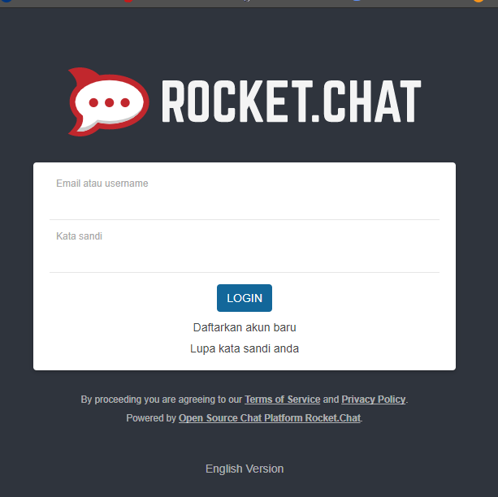
    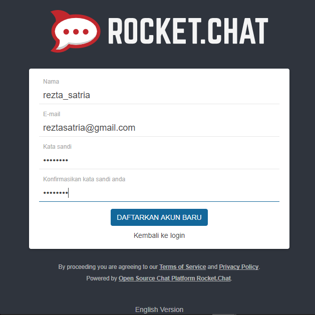
  </p>

2. Masukkan nama pengguna yang akan ditampilkan sebagai `username`
  <p align="center">
    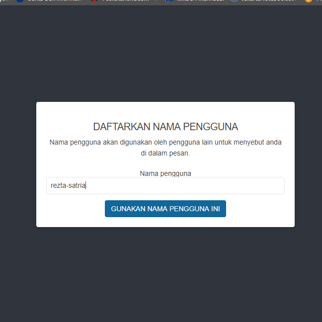
  </p>

3. Setelah registrasi / login berhasil, pengguna akan diarahkan ke halaman `Home`.
  <p align="center">
    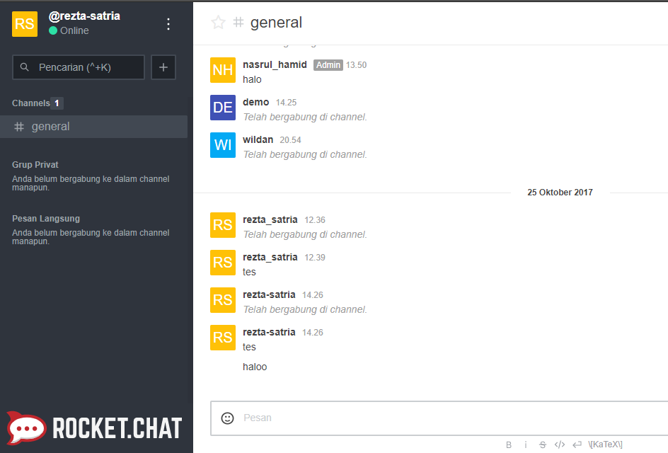
  </p>
  
## Fitur-Fitur Utama 
  
### 1. Channel

`Channel` dapat diilustrasikan seperti sebuah ruangan berisi beberapa pengguna. Pada implementasi aplikasi _chat_ yang lain fitur ini biasa disebut _Group_. Secara default, pengguna tergabung dalam `channel` **General**.
  
1. Membuat grup di Rocket.Chat dapat dilakukan dengan meng-klik tanda “+” yang berada disebelah kolom search. untuk tampilan lebih jelasnya dapat dilihat pada gambar di bawah ini.
  
  <p align="center">
    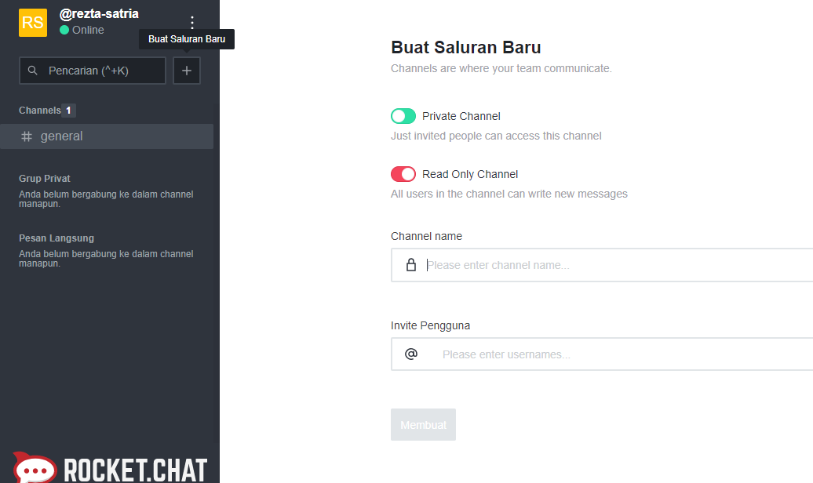
  </p>

2. Selanjutnya kita bisa memilih untuk membuat grup atau channel dengan cara meng-klik button private channel. jika kita ingin membuat grup (private channel) maka kita pilih button tersebut menjadi warna hijau. Selanjutnya jika kita ingin membuat channel (public channel) maka kita klik button tersebut sehingga warna nya berubah menjadi warna merah.

  <p align="center">
    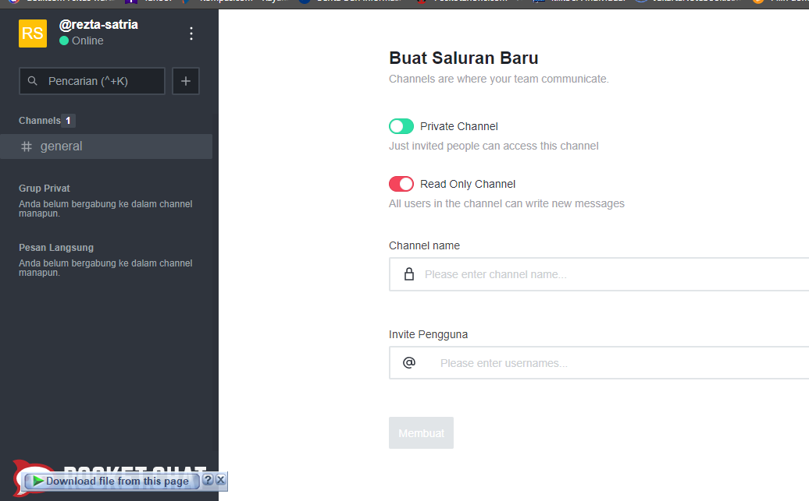
  </p>

3. Selanjutnya setelah grup/channel berhasil dibuat, maka akan muncul tampilan seperti di bawah ini. Kita juga dapat melakukan mention ke user lain dengan cara ketik (@username).

  <p align="center">
    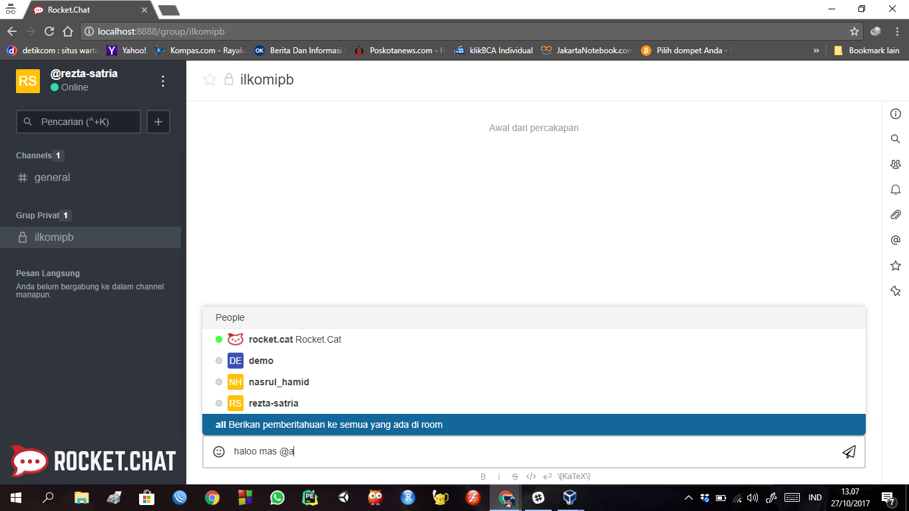
  </p>

4. Selanjutnya untuk melakukan mention ke semua user yang ada digrup, langsung saja ketikan (@all) dikolom chat seperti pada gambar di bawah.
  
  <p align="center">
    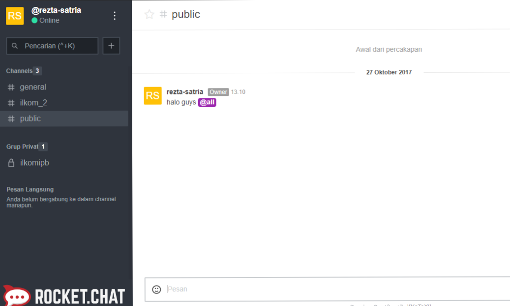
  </p>

### 2. ShortKey

Beberapa tombol cepat _(ShortKey)_ yang dapat digunakan pada Rocket.Chat antara lain:

|Shortcut key       |Keterangan|
|---|---|
|<kbd>Enter</kbd>   |Kirim pesan|
|<kbd>Shift</kbd> + <kbd>Enter</kbd>|Baris baru|
|`@<people>`      |mengirim notifikasi ke user tertentu|
|`@all`             |mengirim notifikasi ke seluruh member dalam `channel`|
|`@here`|mengirim notifikasi ke pengguna yang sedang aktif|
|`#<channel>`|membuat link / tag `channel`|
|`/create #<channel>`|Membuat `channel`|
|`/archive #<channel>`|Mengarsipkan `channel`|
|`/leave`           |Keluar dari `channel`|
|`/invite @<people>`|Mengundang user untuk bergabung ke dalam `channel` aktif|
|`/invite-all-from #<channel-x>`|Mengundang semua user dalam suatu `channel-x` untuk bergabung ke dalam `channel` aktif|
|`/invite-all-to #<channel-x>`  |Mengundang semua user dalam `channel` aktif untuk bergabung ke `channel-x`|
|`/join #<channel>` |Bergabung ke `channel`|
|`/kick @people`    |Mengelouarkan seseorang dari `channel`|
|`/help`|Memunculkan daftar tombol cepat (Shortcut)|

### 3. Panel Pengaturan dan Pencarian

<p align="center">
  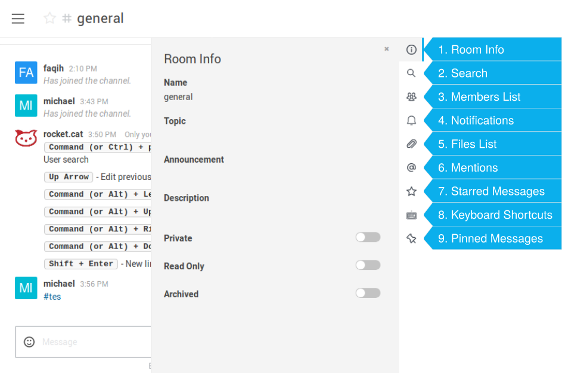
</p>

Pada sisi kanan ruang percakapan terdapat panel pengaturan dan pencarian.

1. **Room Info:** Informasi dan pengaturan ruangan.
Beberapa pengaturan yang dimungkinkan antara lain: nama ruangan, topik, deskripsi, _private / public_, _read only_, _archived_, dan _password_.
2. **Search:** Penelusuran pesan. Regex dibungkinkan.
3. **Members List:** Daftar anggota.
4. **Notifications:** Pengaturan notifikasi
5. **Files List:** Daftar file
6. **Mentions:** Daftar _mention_
7. **Starred Messages:** Daftar pesan yang ditandai (favorit)
8. **Keyboard Shortcuts:** Daftar tombol cepat.
9. **Pinned Messages:** Daftar pinned messages.

### 4. Livechat

Fitur Livechat memungkinkan layanan _chat_ diakses dari halaman web layaknya representasi _customer service_. Fitur ini dapat diaktifkan dari menu [**Administration > Livechat**](https://localhost/admin/Livechat).


<p align="center">
  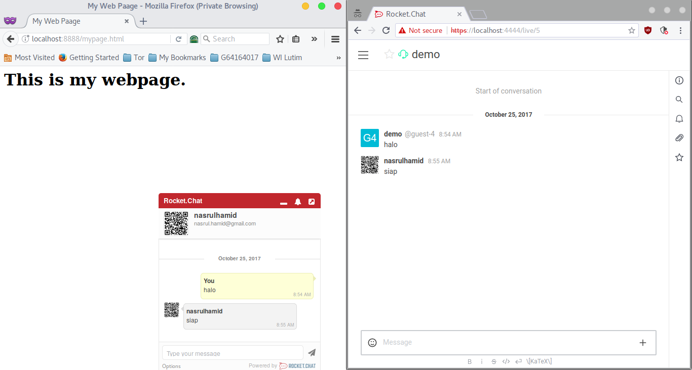
</p>

1. Fitur `LiveChat` dapat diaktifkan dari menu [**Administration > Livechat**](https://localhost/admin/Livechat). Setelah mengaktifkan fitur ini, menu **Livechat Manager** akan ditampilkan pada _side-menu_ untuk mengakomodir pengelolaan Livechat lanjutan di antaranya pengaturan role user pada LiveChat dan departemen.

<p align="center">
  
</p>

2. Pada menu <b><a href="https://localhost/livechat-manager/installation">Livechat Manager > Installaltion</a></b> diberikan script untuk diletakkan pada halaman web.

<p align="center">
  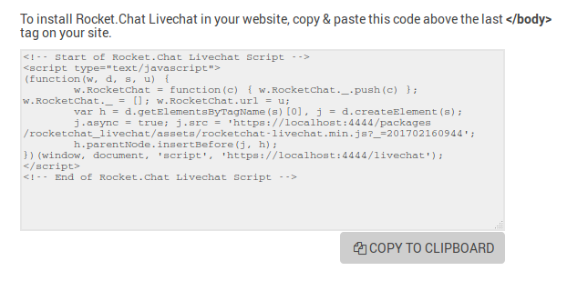
</p>

### 5. OAuth

OAuth merupakan metode autentikasi meggunakan akun aplikasi lain. Rocket.Chat mendukung beberapa OAuth seperti GitHub, Facebook, Google. 

1. Fitur `OAuth` dapat diaktifkan pada Menu **[Administration > OAuth](https://localhost/admin/OAuth)**.

<p align="center">
  
</p>

2. **Client Id** dan **Client Secret** Github dapat dibuat melalui halaman Github pada menu [**Settings > Developer settings > OAuth Apps**](https://github.com/settings/developers).

<p align="center">
  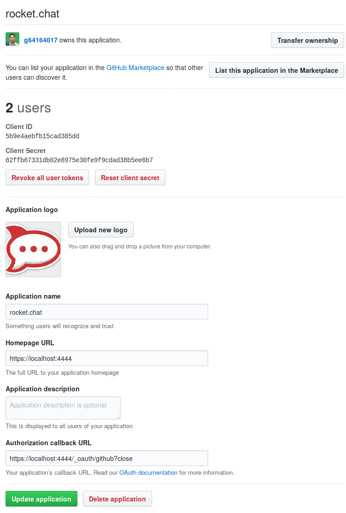
</p>

3. Setelah penyesuaian konfigurasi, tombol login menggunakan OAuth akan muncul pada halaman login.

<p align="center">
  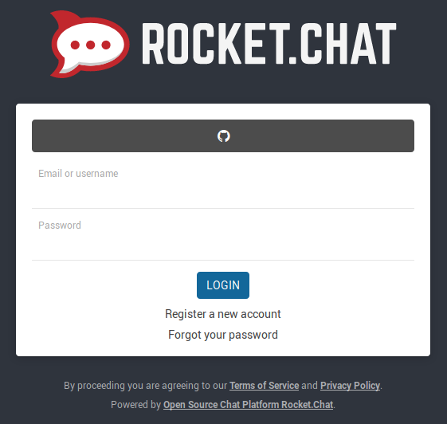
</p>

### 6.  Lihat Log

Untuk keperluan pemeliharaan, log status layanan dapat diakses dari menu [**Administration > View Logs**](https://localhost/admin/view-logs).

<p align="center">
  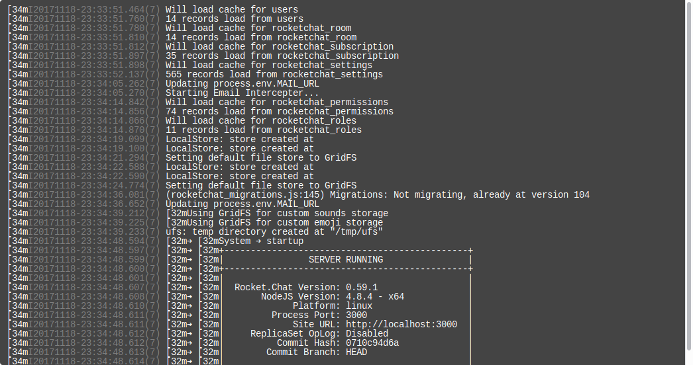
</p>


# Pembahasan
[`^ kembali ke atas ^`](#home)

## Kekurangan dan Kelebihan
Rocket Chat merupakan Web Chat Server yang dikembangkan dalam <code>Javascript</code> dengan menggunakan <code>Meteor Fullstack Framework</code>. Rocket Chat dapat menjadi solusi yang bagus
untuk komunitas atau perusahaan yang menginginkan chat service mereka dihosting secara private. Sebagai aplikasi chat open source alternatif dari slack, Rocket Chat memiliki kelebihan sebagai berikut [[3]](#3):

- Dapat dihosting pada private server, sehingga kemanan data chat service lebih terjamin dan dapat di kustomisasi sesuai kebutuhan.
- Realtime translation. Rocket Chat menggunakan teknologi machine learning untuk melakukan automatic real time translation ketika user melakukan chat.
- Multiplatform. Rocket Chat dapat digunakan di Android, IOS, web based dan desktop based.
- Tersedianya banyak plugin, system integration, tema tampilan aplikasi dan powerful API.
- Menyediakan banyak skema authentikasi, seperti LDAP Group Sync, two-factor authentication (2-FA), E2E encryption, SSO, dan mendukung banyak skema authentikasi OAuth.
- Unlimited users, channels, searches, guests, messages danfiles.

Disamping memiliki banyak kelebihan, Rocket Chat memiliki beberapa kekurangan yang perlu dipertimbangkan antara lain:
- Versi cloud dari Rocket Chat masih belum free
- Karena versi gratis dari Rocket Chat harus dihosting secara private, pengguna harus memahami tata cara instalasi Rocket Chat dan tata cara maintenance-nya.

## Perbandingan Rocket Chat dan Slack
Aplikasi Chat Service lain yang banyak digunakan saat ini adalah Slack. Salah satu sebab Slack mejadi aplikasi chat favorit karena mudah diintegrasikan dengan banyak tools, akan tetapi Slack sangat terbatas terutama dalam versi gratisnya dan versi berbayarnya sangat mahal. Berikut ini beberapa perbandingan antara Slack dan Rocket Chat [[4]](#4):

- Aplikasi Rocket Chat dapat di jalankan pada private hosting dan tersedia pula versi cloud-nya walaupun tidak gratis, sedangkan slack tidak dapat dijalankan pada private hosting melaikan hanya tersedia versi cloud-nya saja.
- Methode autentikasi yang disediakan Rocket Chat lebih banyak dibandingkan dengan Slack.
- Slack lebih mudah di integrasikan dengan berbagai macam tools seperti github, trello dan lain sebagainya. Berbeda dengan Rocket Chat, pengguna perlu melakukan setup sendiri untuk mengintegrasikan Rocket Chat dengan aplikasi atau tools lain.
- Slack memiliki fungsi search yang powerfull, pengguna dapat melakukan pencarian medalam terhadap file, potongan kode program (snippet), bahkan slack dapat melakukan pecarian data pada service yang diintegrasikan dengannya, sedangkan Rocket Chat hanya menyediakan fungsi search trivial seperti kebanyakan aplikasi chat lainnya.


# Referensi
[`^ kembali ke atas ^`](#home)

1. <a id="1" href="https://docs.rocket.chat">Rocket.Chat Documentation - Rocket.Chat</a> 
2. <a id="2" href="https://www.digitalocean.com/community/tutorials/how-to-install-configure-and-deploy-rocket-chat-on-ubuntu-14-04">How To Install, Configure, and Deploy Rocket.Chat on Ubuntu 14.04 - DigitalOcean</a>
3. <a id="3" href="https://obviate.io/2015/09/25/why-slack-when-you-can-rocket-chat">Rocket.Chat Review</a>
4. <a id="4" href="https://www.slant.co/versus/4553/10600/~slack_vs_rocket-chat">User base vote on Compariton Rocket.Chat and Slack</a>
